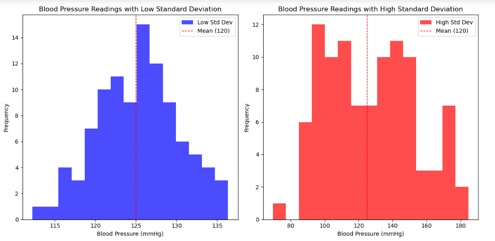

# Project1-STM-Blood-Pressure-Stability
> **Brief Description:** Here blood pressure study of systolic readings of two individuals indicate that one is stable and other is heavily fluctuating causing greater risk of heart attack.

---

## Table of Contents

- [Description](#description)
- [Video Explanation](#video)
- [Technologies Used](#technologies-used)
- [Dataset](#dataset)
- [Program Codes ](#program-codes)
- [Screenshots](#screenshots)
- [Contribution](#contributipn)
- [Contact Details](#contact-details)

---

## Description

Here is a Python program using the pandas and matplotlib libraries to create a line chart showing the trend of dengue cases over time. This example assumes you have a CSV file with two columns: "Date" and "Cases," where "Date" is in a datetime format and "Cases" represents the number of dengue cases reported.

## Video

## Technologies-used

Python programming language, pandas and matplotlib package.

## Dataset

The data file used in this program is a csv file which has been generated by another program. However, it is recommended that for real life analysis actual data should be collected and processed properly to get realistic results.

## Program-codes

The programs are written on jupiter notebook, You may run the program on Google colab by clicking on the colab badge below.

## Screenshots

## Contribution

The programs are written by Santanu Karmakar
